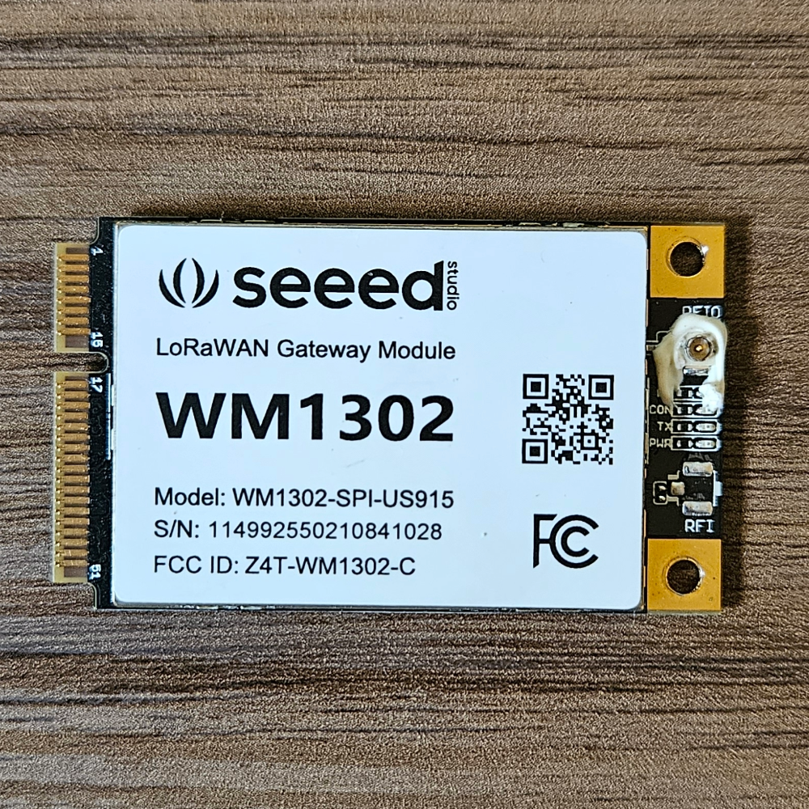

# LoRaWAN Gateway

This repository is dedicated to documenting insights and key information on building a LoRaWAN gateway. As a result, constructing at least one End Node will also be necessary. The primary goal is to develop a gateway capable of connecting to The Things Network (TTN) and receiving data from the End Node. This setup will facilitate a deeper understanding of LoRaWAN network concepts and variables.

## Gateway Hardware

### WM1302 LoRaWAN Gateway Module (915MHz version) <a href="https://www.seeedstudio.com/WM1302-LoRaWAN-Gateway-Module-SPI-US915-SKY66420-p-5455.html">🔗</a>
[Official website](https://www.seeedstudio.com)

### SenseCAP M1 Board <a href="https://www.sensecapmx.com/docs/sensecap-m1/overview/">🔗</a>
[Official website](https://www.sensecapmx.com)

### Raspberry Pi Zero 2W <a href="https://www.raspberrypi.com/products/raspberry-pi-zero-2-w/">🔗</a>
[Official website](https://www.raspberrypi.com)

### Final Assembly

## WM1302 Architecture

### 1. SX1302 (LoRa Baseband Concentrator)

- **Role:** LoRaWAN Gateway Chip (Baseband processor)
- **Description:** The **SX1302** is a high-performance LoRa baseband concentrator chip used in **LoRaWAN gateways**. It can demodulate multiple LoRa signals simultaneously, making it ideal for handling large numbers of end nodes.
- **Use Case:** Designed for gateways that receive and process LoRa packets from multiple end nodes and forward them to a network server.
- **Features:**
  - Supports **multi-channel** LoRa reception
  - Low power consumption compared to its predecessor (**SX1301**)
  - Supports **8 uplink channels + 1 downlink channel**
  - Lower latency and improved network performance
  - [Datasheet](datasheets/SX1302.pdf)

### 2. SX1262 (LoRa Transceiver)

- **Role:** LoRa End Device Chip (Transceiver)
- **Description:** The **SX1262** is a LoRa transceiver chip used in **LoRa end devices (nodes)** to send and receive LoRa packets.
- **Use Case:** Ideal for battery-operated IoT sensors and end nodes that communicate with a LoRa gateway.
- **Features:**
  - Supports both **LoRa and FSK modulation**
  - Lower power consumption than **SX127x series**
  - **Improved link budget** (better range and reliability)
  - Supports **long-range communication**
  - Available in different frequency bands (EU, US, etc.)
  - [Datasheet](datasheets/SX1262.pdf)

### 3. SX1250 (LoRa RF Front-End)

- **Role:** RF Transceiver Front-End
- **Description:** The **SX1250** is an RF front-end chip designed to work alongside the **SX1302** to handle **RF reception and transmission** in a LoRa gateway.
- **Use Case:** Used in LoRaWAN gateways, particularly in modern designs (e.g., WM1302) for improved performance and lower power consumption.
- **Features:**
  - **Higher sensitivity** than SX1257 (older alternative)
  - Lower power consumption
  - Supports **multiple frequency bands**
  - [Datasheet](datasheets/SX1250.pdf)
 
### 4. WM1302 (LoRaWAN Gateway Module)

- **Role:** Full Gateway Module (Based on SX1302)
- **Description:** The **WM1302** is not a standalone chip but a complete **LoRaWAN gateway module**.
- **Use Case:** Used in LoRaWAN gateways to provide **multi-channel** LoRa reception and transmission capabilities.
- **Features:**
  - Uses the **SX1302** as the baseband processor
  - Uses the **SX1250** as an RF front-end
  - Uses the **SX1262** as an LoRa Transceiver (enabling the Listen Before Talk (LBT) feature for enhanced communication efficiency and reduced interference)
  - Supports **LoRaWAN class A/B/C devices**
  - [Datasheet](datasheets/WM1302.pdf)

## End Node Hardware

### Heltec LoRa v2 Board (915MHz version) <a href="https://heltec.org/project/wifi-lora-32v2/">🔗</a>
[Official website](https://heltec.org)
[Schematic](node/hardware/Schematic%20-%20Heltec%20LoRa%20v2%20(915MHz%20version).pdf)

### SX1276 (LoRa Transceiver)  
  
- **Role:** LoRa End Device Chip (Transceiver)  
- **Description:** The **SX1276** is a LoRa transceiver chip widely used in **LoRa end devices (nodes)** for long-range wireless communication. It supports both **LoRa and FSK/OOK** modulation schemes, making it a versatile choice for IoT applications.  
- **Use Case:** Suitable for battery-powered IoT sensors, industrial monitoring, and remote control applications that communicate with a LoRa gateway.  
- **Features:**  
  - Supports **LoRa, FSK, and OOK modulation**  
  - **Long-range communication** with high sensitivity (-137 dBm)  
  - **Configurable spreading factors (SF6-SF12)** for adaptive data rates  
  - **Wide frequency range** (137 MHz – 1020 MHz) covering multiple regions  
  - Low power consumption for battery-operated devices  
  - [Datasheet](datasheets/SX1276.pdf)

## Network Server

My gateway is online and successfully connected to TTN. Interestingly, I now have the only available LoRaWAN gateway in São Bernardo do Campo, SP - Brazil.

