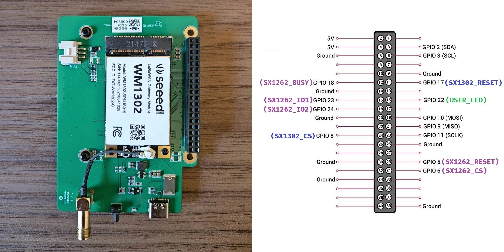

# LoRaWAN Gateway

This repository provides insights and relevant information about the LoRaWAN ecosystem, with a primary focus on building a LoRaWAN-compatible gateway. The main objective is to develop a gateway capable of receiving data from an end-node and forwarding it to The Things Network (TTN). To achieve this, we will explore the three key components of a LoRaWAN network: the *end-node*, the *gateway*, and the *network server*. This documentation aims to provide a comprehensive understanding of the concepts, components, and configuration involved, with an emphasis on gateway development.

  

Gateway

### WM1302 LoRaWAN Gateway Module (915MHz Version) <a href="https://www.seeedstudio.com/WM1302-LoRaWAN-Gateway-Module-SPI-US915-SKY66420-p-5455.html">🔗</a>
[Official Website](https://www.seeedstudio.com)

### SenseCAP M1 Board <a href="https://www.sensecapmx.com/docs/sensecap-m1/overview/">🔗</a>
[Official Website](https://www.sensecapmx.com)

### Raspberry Pi Zero 2W <a href="https://www.raspberrypi.com/products/raspberry-pi-zero-2-w/">🔗</a>
[Official Website](https://www.raspberrypi.com)

### Final Assembly

## WM1302 Architecture

### 1. SX1302 (LoRa Baseband Concentrator)

- **Role:** LoRaWAN Gateway Chip (Baseband Processor)
- **Description:** The **SX1302** is a high-performance LoRa baseband concentrator chip used in **LoRaWAN gateways**. It can demodulate multiple LoRa signals simultaneously, making it ideal for handling large numbers of end nodes.
- **Use Case:** Designed for gateways that receive and process LoRa packets from multiple end nodes and forward them to a network server.
- **Key Features:**
  - Multi-channel LoRa reception
  - Low power consumption compared to the **SX1301**
  - Supports **8 uplink channels + 1 downlink channel**
  - Reduced latency and improved network performance
  - [Datasheet](datasheets/SX1302.pdf)

### 2. SX1262 (LoRa Transceiver)

- **Role:** LoRa End Device Chip (Transceiver)
- **Description:** The **SX1262** is a LoRa transceiver chip designed for **LoRa end devices** (nodes) to send and receive LoRa packets.
- **Use Case:** Ideal for battery-operated IoT sensors and end nodes communicating with a LoRa gateway.
- **Key Features:**
  - Supports both **LoRa and FSK modulation**
  - Lower power consumption compared to the **SX127x series**
  - Improved link budget for better range and reliability
  - Long-range communication support
  - Available in multiple frequency bands (EU, US, etc.)
  - [Datasheet](datasheets/SX1262.pdf)

### 3. SX1250 (LoRa RF Front-End)

- **Role:** RF Transceiver Front-End
- **Description:** The **SX1250** is an RF front-end chip designed to work alongside the **SX1302** for RF reception and transmission in LoRaWAN gateways.
- **Use Case:** Employed in modern LoRaWAN gateways, such as the **WM1302**, to improve performance and reduce power consumption.
- **Key Features:**
  - Higher sensitivity than the **SX1257**
  - Lower power consumption
  - Multi-frequency band support
  - [Datasheet](datasheets/SX1250.pdf)

### 4. WM1302 (LoRaWAN Gateway Module)

- **Role:** Complete Gateway Module (Based on SX1302)
- **Description:** The **WM1302** is a complete LoRaWAN gateway module that integrates several components to handle multi-channel LoRa communication.
- **Use Case:** Used in LoRaWAN gateways to provide enhanced LoRa reception and transmission capabilities.
- **Key Features:**
  - Uses the **SX1302** as the baseband processor
  - Integrates the **SX1250** RF front-end and **SX1262** LoRa transceiver
  - Supports **LoRaWAN class A/B/C devices**
  - [Datasheet](datasheets/WM1302.pdf)

End-Node

### Heltec LoRa v2 Board (915MHz Version) <a href="https://heltec.org/project/wifi-lora-32v2/">🔗</a>
[Official Website](https://heltec.org)

[Schematic](node/hardware/Schematic%20-%20Heltec%20LoRa%20v2%20(915MHz%20version).pdf)

## Node Architecture

### SX1276 (LoRa Transceiver)  
  
- **Role:** LoRa End Device Chip (Transceiver)  
- **Description:** The **SX1276** is a widely-used LoRa transceiver chip for long-range wireless communication in **LoRa end devices (nodes)**. It supports **LoRa, FSK, and OOK modulation**, making it a flexible option for various IoT applications.  
- **Use Case:** Perfect for battery-powered IoT sensors, industrial monitoring, and remote control systems communicating with a LoRa gateway.  
- **Key Features:**  
  - Supports **LoRa, FSK, and OOK modulation**
  - **Long-range communication** with high sensitivity (-137 dBm)
  - Configurable spreading factors (SF6-SF12) for adaptive data rates
  - **Wide frequency range** (137 MHz – 1020 MHz), covering multiple regions
  - Low power consumption for IoT applications
  - [Datasheet](datasheets/SX1276.pdf)

Network Server

 
My gateway is online and successfully connected to TTN. Interestingly, I am now the only available LoRaWAN gateway in São Bernardo do Campo, SP, Brazil.
 
  

